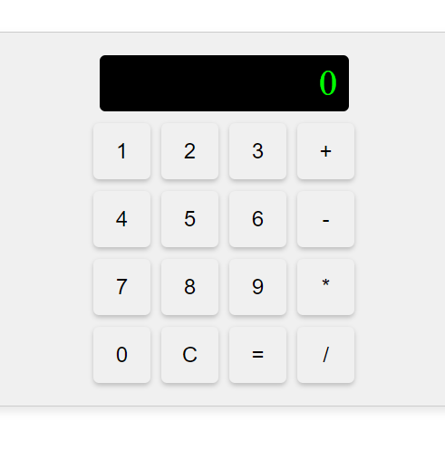

# Simple React Calculator

A basic calculator app built with React.js. This calculator supports basic arithmetic operations such as addition, subtraction, multiplication, and division.

## Features

- **Basic Operations**: Addition, subtraction, multiplication, and division.
- **Error Handling**: Displays "Error" for invalid operations.

## Usage

1. **Basic Usage**:
   - Click the number buttons to input values.
   - Use the operators (`+`, `-`, `*`, `/`) for arithmetic operations.
   - Click `=` to evaluate the expression.
   - Click `C` to clear the display.

## Try It Yourself

To try this calculator on your own device, follow these steps:

1. **Create a new React app**:

```bash
npx create-react-app my-simple-calculator
cd my-simple-calculator
```

2.**Replace the content of App.js and App.css:**
  - Copy the code of `App.js` and `App.css` from this repository.
  - Paste it into your own `App.js` and `App.css` files in your newly created React app.

3. Start the application:
```bash
npm start
```

The app should now be running on http://localhost:3000.

## Usage

1. **Basic Usage**:
   - Click the number buttons to input values.
   - Use the operators (`+`, `-`, `*`, `/`) for arithmetic operations.
   - Click `=` to evaluate the expression.
   - Click `C` to clear the display.

## Project Structure

- `src/`
  - `App.js`: Main React component for the calculator.
  - `App.css`: CSS file for styling the calculator.
  - `index.js`: Entry point of the application.

## Contributing

Contributions are welcome! Please fork the repository and create a pull request with your changes.

1. Fork the project
2. Create your feature branch (`git checkout -b feature/AmazingFeature`)
3. Commit your changes (`git commit -m 'Add some AmazingFeature'`)
4. Push to the branch (`git push origin feature/AmazingFeature`)
5. Open a pull request

## Acknowledgements

- [React.js](https://reactjs.org/)
- App developed by Yassin Ali

## Screenshot


